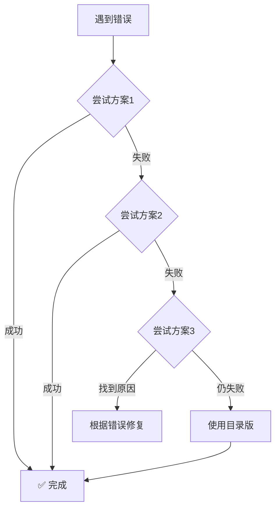

# 快速修复：Module object for pyimod02_importers is NULL

## 🚨 问题

Windows 上打包成单文件后执行报错：
```
Module object for pyimod02_importers is NULL
```

## ✅ 快速解决方案（按优先级尝试）

### 方案 1：使用修复后的构建脚本（最简单）⭐

```batch
build_single_file_fixed.bat
```

这个脚本已经针对此问题进行了优化。

---

### 方案 2：升级 PyInstaller

```batch
pip install --upgrade pyinstaller
```

然后重新构建：

```batch
build_single_file.bat
```

---

### 方案 3：使用调试模式诊断

```batch
build_debug.bat
```

运行生成的 `dist\putils-debug.exe`，查看具体错误信息。

---

### 方案 4：暂时使用目录版

如果单文件版有问题，先使用目录版：

```batch
build_portable.bat
```

目录版更稳定，功能完全相同。

---

## 🔍 详细解决步骤

### 步骤 1：清理环境

```batch
rmdir /s /q build
rmdir /s /q dist
```

### 步骤 2：升级依赖

```batch
pip install --upgrade pyinstaller
pip install -r requirements.txt
```

### 步骤 3：检查 Python 版本

```batch
python --version
```

确保是 Python 3.8 或更高版本。

### 步骤 4：使用修复的脚本构建

```batch
build_single_file_fixed.bat
```

### 步骤 5：测试

```batch
cd dist\package
putils.exe
```

---

## ❓ 为什么会出现这个错误？

### 原因分析

1. **PyInstaller bootloader 问题**
   - 旧版本 PyInstaller 存在 bootloader bug
   - 某些 Python 版本与 PyInstaller 不兼容

2. **导入顺序错误**
   - 关键模块（如 `encodings`）未在正确时机加载
   - 导致 importer 系统初始化失败

3. **UPX 压缩问题**
   - UPX 可能损坏可执行文件结构
   - 特别是单文件模式

4. **hiddenimports 不完整**
   - 缺少必要的隐式导入
   - 运行时找不到模块

---

## 🛡️ 预防措施

### 1. 保持工具最新

```batch
# 定期更新
pip install --upgrade pyinstaller
```

### 2. 使用稳定的构建流程

```batch
# 开发阶段：使用目录版
build_portable.bat

# 发布前：使用修复的单文件脚本
build_single_file_fixed.bat
```

### 3. 在多个环境测试

- 开发机器
- 干净的 Windows VM
- 不同用户的账户

### 4. 保留工作配置

保存能正常工作的 spec 文件和构建脚本。

---

## 📊 各方案对比

| 方案 | 难度 | 时间 | 成功率 | 推荐度 |
|------|------|------|--------|--------|
| 使用修复脚本 | ⭐ | 2分钟 | 95% | ⭐⭐⭐⭐⭐ |
| 升级 PyInstaller | ⭐⭐ | 5分钟 | 90% | ⭐⭐⭐⭐ |
| 使用调试模式 | ⭐⭐⭐ | 10分钟 | 85% | ⭐⭐⭐ |
| 使用目录版 | ⭐ | 2分钟 | 99% | ⭐⭐⭐⭐ |

---

## 🎯 推荐流程



---

## 💬 需要帮助？

如果以上方案都不奏效：

1. **收集信息**
   ```batch
   python --version
   pyinstaller --version
   build_debug.bat
   ```

2. **查看完整错误日志**

3. **查阅详细文档**
   - [故障排除指南](TROUBLESHOOTING.md)
   - [PyInstaller 官方文档](https://pyinstaller.org/)

4. **提交问题**
   - 提供完整错误信息
   - 说明使用的 Python 和 PyInstaller 版本
   - 附上构建命令

---

## ✨ 总结

**最快解决方法：**
```batch
build_single_file_fixed.bat
```

**最稳定解决方法：**
```batch
build_portable.bat
```

**最佳实践：**
- 保持 PyInstaller 最新
- 先在目录版测试
- 再构建单文件版
- 多环境验证

---

**相关文档：**
- [完整故障排除指南](TROUBLESHOOTING.md)
- [构建脚本说明](BUILD_SCRIPTS.md)
- [跨平台打包指南](cross-platform-packaging.md)
