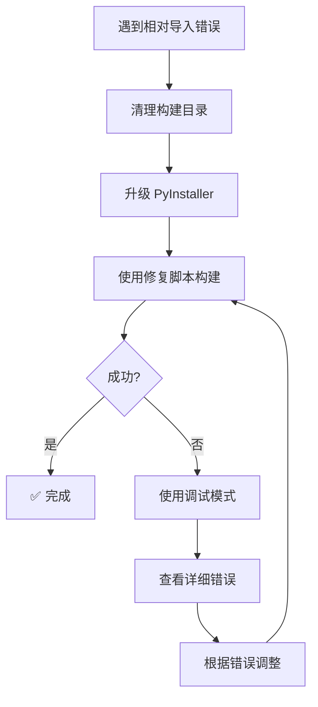

# 快速修复：ImportError: attempted relative import with no known parent package

## 🚨 问题

打包后运行报错：
```python
Traceback (most recent call last):
  File "app.py", line 11, in <module>
ImportError: attempted relative import with no known parent package
```

## 🔍 原因分析

这个错误是因为：
1. **相对导入问题** - `app.py` 使用了相对导入（如 `from .database import ...`）
2. **包结构丢失** - PyInstaller 打包后，Python 无法识别 `putils` 包的层次结构
3. **__name__ 变化** - 打包后 `__name__` 变为 `'__main__'` 而不是 `'putils.app'`

## ✅ 解决方案

### 方案一：使用修复后的构建脚本（推荐）⭐

```batch
build_single_file_fixed.bat
```

这个脚本已经：
- ✅ 显式包含所有模块文件作为数据文件
- ✅ 正确配置 hiddenimports
- ✅ 保持包结构完整性

### 方案二：使用调试模式诊断

```batch
build_debug.bat
```

查看详细的导入错误信息。

### 方案三：修改为绝对导入（代码层面）

如果上述方案都不行，可以修改源代码将相对导入改为绝对导入。

**修改前：**
```python
from .database import CacheStore, ConfigStore, LogStore
from .i18n import DEFAULT_LANGUAGE, SUPPORTED_LANGUAGES, Translator
```

**修改后：**
```python
from putils.database import CacheStore, ConfigStore, LogStore
from putils.i18n import DEFAULT_LANGUAGE, SUPPORTED_LANGUAGES, Translator
```

⚠️ **注意**：这需要修改多个文件，不推荐作为首选方案。

---

## 🛠️ 详细解决步骤

### 步骤 1：清理旧构建

```batch
rmdir /s /q build
rmdir /s /q dist
```

### 步骤 2：升级 PyInstaller

```batch
pip install --upgrade pyinstaller
```

### 步骤 3：使用修复脚本重新构建

```batch
build_single_file_fixed.bat
```

### 步骤 4：测试运行

```batch
cd dist\package
putils.exe
```

---

## 📋 关键配置说明

### PyInstaller spec 文件的关键部分

```python
a = Analysis(
    ['putils/app.py'],  # 入口点
    datas=[
        ('putils/*.py', 'putils'),           # 包含所有模块
        ('putils/plugins/*.py', 'putils/plugins'),  # 包含插件
    ],
    hiddenimports=[
        'putils',                            # 根包
        'putils.app',                         # 主模块
        'putils.database',                    # 依赖模块
        'putils.i18n',
        'putils.paths',
        'putils.plugin_api',
        'putils.plugin_loader',
        'putils.tk_utils',
        'putils.plugins',                     # 插件包
        'putils.plugins.video_saturation',    # 具体插件
    ],
)
```

### 构建脚本的关键参数

```batch
--add-data "putils/database.py;putils"      # 显式包含每个模块
--add-data "putils/i18n.py;putils"
--hidden-import=putils                       # 声明隐式导入
--hidden-import=putils.database
```

---

## 🔧 如果仍然失败

### 检查清单

- [ ] 确认 `putils/__init__.py` 存在
- [ ] 确认所有 `.py` 文件都在正确位置
- [ ] 确认没有循环导入
- [ ] 确认 PyInstaller 版本 >= 6.0

### 验证包结构

```batch
dir putils\*.py
```

应该看到：
- `__init__.py`
- `app.py`
- `database.py`
- `i18n.py`
- `paths.py`
- `plugin_api.py`
- `plugin_loader.py`
- `tk_utils.py`

### 使用目录版测试

如果单文件版仍有问题，先使用目录版验证功能：

```batch
build_portable.bat
cd dist\putils
putils.exe
```

---

## 💡 预防措施

### 1. 保持包结构完整

确保 `putils/` 目录下有 `__init__.py` 文件：

```python
# putils/__init__.py
"""PUtils - Portable Utility Application"""
__version__ = "0.1.0"
```

### 2. 使用一致的导入方式

在整个项目中统一使用相对导入或绝对导入，不要混用。

### 3. 定期测试打包

每次重大修改后都测试打包：

```batch
build_portable.bat  # 快速测试
build_single_file_fixed.bat  # 最终发布
```

### 4. 保存工作配置

保留能正常工作的 spec 文件和构建脚本。

---

## 📊 各方案对比

| 方案 | 难度 | 时间 | 成功率 | 推荐度 |
|------|------|------|--------|--------|
| **使用修复脚本** | ⭐ | 2分钟 | 95% | ⭐⭐⭐⭐⭐ |
| 使用调试模式 | ⭐⭐ | 5分钟 | 90% | ⭐⭐⭐⭐ |
| 修改为绝对导入 | ⭐⭐⭐ | 30分钟 | 99% | ⭐⭐⭐ |
| 使用目录版 | ⭐ | 2分钟 | 99% | ⭐⭐⭐⭐ |

---

## 🎯 推荐工作流程



---

## 📚 相关文档

- **[PyInstaller 打包错误排查](TROUBLESHOOTING.md)** - 完整故障排除指南
- **[Module object for pyimod02_importers is NULL](QUICK_FIX_IMPORTERS_ERROR.md)** - 另一个常见错误
- **[构建脚本说明](BUILD_SCRIPTS.md)** - 所有构建脚本详解
- **[跨平台打包指南](cross-platform-packaging.md)** - 完整教程

---

## ✨ 总结

**最快解决方法：**
```batch
build_single_file_fixed.bat
```

**关键点：**
- ✅ 显式包含所有模块文件
- ✅ 正确配置 hiddenimports
- ✅ 保持包结构完整性
- ✅ 使用最新版本的 PyInstaller

**如果仍有问题：**
1. 使用 `build_debug.bat` 获取详细错误
2. 暂时使用 `build_portable.bat` 目录版
3. 查看完整的故障排除指南

---

**最后更新**: 2024年  
**适用场景**: PyInstaller 打包相对导入错误
