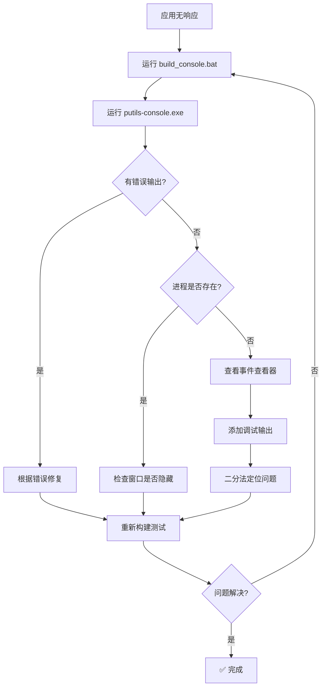

# 应用启动无响应问题排查指南

## 🚨 问题现象

运行打包后的应用：
```batch
.\dist\package\putils.exe
```

**症状：**
- ❌ 没有任何输出
- ❌ 没有错误提示
- ❌ 没有界面弹出
- ❌ 进程可能在后台运行或已退出

---

## 🔍 可能的原因

### 1. 静默崩溃（最常见）⭐
应用在启动时遇到异常，但被静默捕获，没有显示错误信息。

**常见原因：**
- 导入错误（模块找不到）
- tkinter 初始化失败
- 数据库文件访问权限问题
- 插件加载失败
- 配置文件损坏

### 2. 窗口在后台
应用启动了，但窗口被最小化或在其他桌面后面。

### 3. 无限循环/阻塞
应用在启动时进入无限循环或等待某个操作。

### 4. PyInstaller 配置问题
- 缺少必要的依赖
- 数据文件未包含
- 路径配置错误

---

## ✅ 解决方案（按优先级尝试）

### 方案一：使用控制台版本诊断（推荐）⭐⭐⭐

**步骤 1：构建控制台版本**
```batch
build_console.bat
```

这会创建一个带控制台窗口的版本，所有错误都会显示出来。

**步骤 2：运行并查看输出**
```batch
cd dist
putils-console.exe
```

**应该看到：**
- ✅ 如果有错误：会显示完整的 traceback
- ✅ 如果正常：控制台会保持打开，GUI 窗口也会弹出

**示例错误输出：**
```
============================================================
ERROR: Application failed to start!
============================================================
Error type: ImportError
Error message: No module named 'putils.database'
------------------------------------------------------------
Traceback:
  File "app.py", line 11, in <module>
    ...
============================================================
```

### 方案二：使用诊断脚本

```batch
diagnose.bat
```

这个脚本会：
- 检查文件是否存在
- 验证依赖是否完整
- 运行应用并捕获输出
- 保存到 `diagnostic_output.txt`

### 方案三：检查任务管理器

1. 运行 `putils.exe`
2. 打开任务管理器（Ctrl+Shift+Esc）
3. 查看是否有 `putils.exe` 进程
   - **如果有**：说明应用在运行，可能是窗口隐藏了
   - **如果没有**：说明应用启动后立即退出了

### 方案四：检查事件查看器

1. 按 Win+R，输入 `eventvwr.msc`
2. 导航到：Windows 日志 → 应用程序
3. 查找最近的错误事件
4. 查看是否有 Python 或 putils 相关的错误

### 方案五：临时添加调试输出

在 [app.py](file://d:\Workspace\AiDev\putils\putils\app.py) 的开头添加：

```python
import sys
import os

# Debug output
print("Application starting...", file=sys.stderr)
print(f"Python executable: {sys.executable}", file=sys.stderr)
print(f"Current directory: {os.getcwd()}", file=sys.stderr)
print(f"Script directory: {os.path.dirname(os.path.abspath(__file__))}", file=sys.stderr)
sys.stderr.flush()
```

然后重新构建。

---

## 🛠️ 常见问题及修复

### 问题 1：ImportError - 模块找不到

**症状：**
```
ImportError: No module named 'putils.xxx'
```

**解决：**
确保构建脚本中包含所有必要的 hidden-imports：
```batch
--hidden-import=putils
--hidden-import=putils.app
--hidden-import=putils.database
--hidden-import=putils.i18n
--hidden-import=putils.paths
--hidden-import=putils.plugin_api
--hidden-import=putils.plugin_loader
--hidden-import=putils.tk_utils
```

### 问题 2：tkinter 初始化失败

**症状：**
```
_tkinter.TclError: no display name and no $DISPLAY environment variable
```

**解决：**
确保包含完整的 tkinter：
```batch
--collect-all=tkinter
--hidden-import=tkinter
--hidden-import=tkinter.filedialog
--hidden-import=tkinter.messagebox
--hidden-import=tkinter.ttk
```

### 问题 3：数据库文件访问权限

**症状：**
```
sqlite3.OperationalError: unable to open database file
```

**解决：**
检查 [paths.py](file://d:\Workspace\AiDev\putils\putils\paths.py) 中的数据目录配置，确保：
- 目录存在
- 有写入权限
- 路径正确

### 问题 4：插件加载失败

**症状：**
应用在 [_load_plugins](file://d:\Workspace\AiDev\putils\putils\app.py#L188-L210) 时卡住或崩溃

**解决：**
1. 检查插件目录是否存在：
   ```batch
   --add-data "putils/plugins;putils/plugins"
   ```

2. 检查插件模块是否正确声明：
   ```batch
   --hidden-import=putils.plugins
   --hidden-import=putils.plugins.video_saturation
   ```

3. 临时禁用插件加载测试：
   在 [app.py](file://d:\Workspace\AiDev\putils\putils\app.py) 中注释掉插件加载代码

### 问题 5：编码问题导致启动失败

**症状：**
```
UnicodeDecodeError: 'utf-8' codec can't decode byte...
```

**解决：**
确保所有文本文件使用 UTF-8 编码，或在读取时指定编码。

---

## 📋 逐步诊断流程

### 第 1 步：构建控制台版本

```batch
build_console.bat
```

### 第 2 步：运行并观察

```batch
cd dist
putils-console.exe
```

**观察：**
- 控制台是否显示错误？
- GUI 窗口是否弹出？
- 应用是否卡住？

### 第 3 步：根据输出判断

#### 情况 A：显示 ImportError
→ 检查 hidden-imports 配置

#### 情况 B：显示 tkinter 错误
→ 检查 tkinter 相关配置

#### 情况 C：显示数据库错误
→ 检查数据目录权限

#### 情况 D：没有任何输出就退出
→ 检查是否有语法错误或早期异常

#### 情况 E：控制台保持打开但无窗口
→ 应用可能卡在某个初始化步骤

### 第 4 步：添加更多调试信息

如果仍然无法确定问题，在 [app.py](file://d:\Workspace\AiDev\putils\putils\app.py) 中添加调试输出：

```python
class PUtilsApp(tk.Tk):
    def __init__(self) -> None:
        print("Step 1: Creating main window", file=sys.stderr)
        super().__init__()
        
        print("Step 2: Setting geometry", file=sys.stderr)
        self.geometry("980x680")
        
        print("Step 3: Initializing config store", file=sys.stderr)
        self.config_store = ConfigStore(config_db_path())
        
        # ... 继续添加调试输出
        
        print("Step N: Initialization complete", file=sys.stderr)
        sys.stderr.flush()
```

### 第 5 步：二分法定位

注释掉部分初始化代码，逐步缩小问题范围：

```python
def __init__(self) -> None:
    super().__init__()
    
    # 先只创建窗口
    self.geometry("980x680")
    print("Window created", file=sys.stderr)
    
    # 如果上面成功，再逐步添加其他代码
    # self._configure_style()
    # self._build_layout()
    # self._load_plugins()
```

---

## 🔧 修复后的改进

我已经在 [app.py](file://d:\Workspace\AiDev\putils\putils\app.py) 中添加了：

### 1. 主入口保护
```python
if __name__ == "__main__":
    main()
```

### 2. 全面的错误处理
```python
try:
    app = PUtilsApp()
    app.mainloop()
except Exception as e:
    # 打印详细错误信息
    # 显示消息框
    # 退出程序
```

### 3. 控制台输出
错误会同时输出到：
- 控制台（console 版本可见）
- 消息框（windowed 版本可见）
- 标准错误流

---

## 📊 快速诊断表

| 症状 | 可能原因 | 解决方案 |
|------|---------|---------|
| 无任何输出，立即退出 | 早期导入错误 | 使用 console 版本查看 |
| 进程存在但无窗口 | 窗口隐藏/最小化 | 检查任务栏，Alt+Tab |
| 进程不存在 | 启动时崩溃 | 查看事件查看器 |
| 控制台显示 ImportError | 缺少 hidden-import | 更新构建脚本 |
| 控制台显示 tkinter 错误 | tkinter 配置问题 | 添加 --collect-all=tkinter |
| 控制台显示数据库错误 | 文件权限问题 | 检查数据目录 |
| 卡在某个步骤 | 初始化阻塞 | 添加调试输出定位 |

---

## 💡 预防措施

### 1. 始终添加错误处理
```python
try:
    # 初始化代码
except Exception as e:
    print(f"Error: {e}", file=sys.stderr)
    raise
```

### 2. 使用日志记录
```python
import logging
logging.basicConfig(level=logging.DEBUG)
logger = logging.getLogger(__name__)
logger.info("Application starting")
```

### 3. 分阶段测试
- 先测试最小可运行版本
- 逐步添加功能
- 每步都测试打包

### 4. 保留工作版本
保存能正常工作的构建配置和代码。

---

## 🎯 推荐的诊断顺序



---

## 📚 相关文档

- **[相对导入最终解决方案](FIX_RELATIVE_IMPORTS_FINAL.md)** - 导入问题修复
- **[批处理文件编码问题](BATCH_FILE_ENCODING_FIX.md)** - 脚本执行问题
- **[完整故障排除指南](TROUBLESHOOTING.md)** - 所有常见问题
- **[PyInstaller 官方文档](https://pyinstaller.org/en/stable/)** - 打包工具文档

---

## ✨ 总结

**最快诊断方法：**
```batch
build_console.bat
cd dist
putils-console.exe
```

**关键改进：**
- ✅ 添加了 `if __name__ == "__main__"` 保护
- ✅ 添加了全面的错误处理和输出
- ✅ 创建了控制台版本构建脚本
- ✅ 创建了诊断脚本

**下一步：**
1. 运行 `build_console.bat` 构建控制台版本
2. 运行 `putils-console.exe` 查看详细错误
3. 根据错误信息针对性修复
4. 如果仍有问题，运行 `diagnose.bat` 获取更多信息

现在应该能看到具体的错误信息了！🔍
